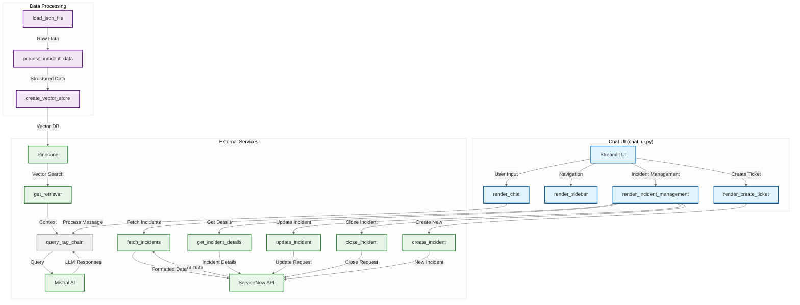

# ITSM RAG Chatbot Architecture

## System Overview

The ITSM (IT Service Management) RAG (Retrieval-Augmented Generation) Chatbot is a sophisticated AI-powered assistant that combines natural language processing with a knowledge base to provide accurate, context-aware responses about service incidents. This document outlines the system architecture, components, and data flow.

## Architecture Diagram



## Component Details

### 1. Chat UI (chat_ui.py)
The main user interface built with Streamlit that provides interaction capabilities.

**Key Functions:**
- `render_chat()`: Handles chat interface and message display
- `render_sidebar()`: Manages navigation and UI controls
- `render_incident_management()`: Displays and manages incident data
- `render_create_ticket()`: Provides form for new incident creation

### 2. Core Services
- **query_rag_chain**: Processes natural language queries using RAG
- **Incident Management**: Handles CRUD operations for incidents
  - `fetch_incidents`: Retrieves list of incidents
  - `get_incident_details`: Gets detailed incident information
  - `update_incident`: Updates existing incidents
  - `close_incident`: Closes resolved incidents
  - `create_incident`: Creates new incidents

### 3. External Integrations

#### ServiceNow API
- **Purpose**: Primary incident data source
- **Key Operations**:
  - Fetch incident lists and details
  - Create/update/close incidents
  - Real-time synchronization

#### Mistral AI
- **Role**: Large Language Model for natural language understanding
- **Features**:
  - Generates human-like responses
  - Processes complex queries
  - Understands context from retrieved documents

#### Pinecone
- **Function**: Vector database for semantic search
- **Features**:
  - Stores document embeddings
  - Enables efficient similarity search
  - Supports hybrid search (keyword + semantic)

### 4. Data Processing Pipeline
1. **Data Loading**:
   - `load_json_file`: Loads raw incident data from file/URL
   - `process_incident_data`: Structures and cleans the data

2. **Vector Store**:
   - `create_vector_store`: Converts documents to embeddings
   - `get_retriever`: Manages document retrieval with various search modes

## Data Flow

1. **Initialization**:
   - Load and process incident data
   - Create vector embeddings
   - Initialize RAG chain with Mistral AI

2. **Chat Interaction**:
   - User submits query
   - System retrieves relevant context
   - RAG generates response using context
   - Response displayed to user

3. **Incident Management**:
   - User views/updates incidents
   - Changes synchronized with ServiceNow
   - UI updates to reflect changes

## Dependencies

- **Core**:
  - Python 3.8+
  - Streamlit (Web UI)
  - LangChain (RAG framework)
  - Pinecone Client (Vector database)
  - Mistral AI (LLM)
  - HuggingFace (Embeddings)
  - Requests (HTTP client)

- **APIs**:
  - ServiceNow REST API
  - Mistral AI API
  - Pinecone API

## Configuration

Environment variables (`.env`):
```
PINECONE_API_KEY=your_pinecone_api_key
MISTRAL_API_KEY=your_mistral_api_key
```

## Usage

1. **Setup**:
   ```bash
   pip install -r requirements.txt
   cp .env.example .env  # Update with your API keys
   ```

2. **Run**:
   ```bash
   streamlit run chat_ui.py
   ```

3. **Access**:
   - Open browser to `http://localhost:8501`
   - Use the chat interface or navigate to incident management

## Troubleshooting

- **API Connection Issues**: Verify API keys in `.env`
- **Vector Search Problems**: Check if Pinecone index exists and is populated
- **LLM Response Quality**: Adjust temperature and max tokens in `rag_chain.py`

## License

[Specify your license here]
